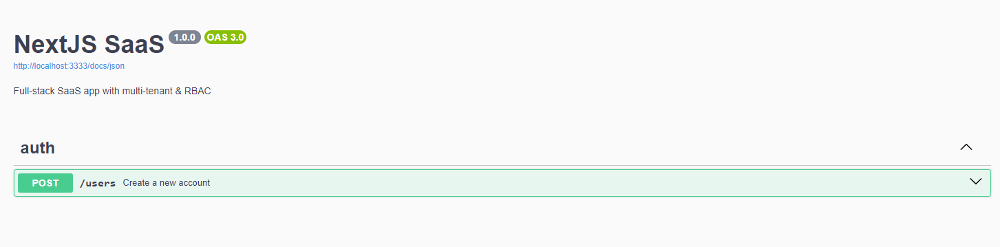

# Next.js SaaS + RBAC

This project contains all the necessary boilerplate to setup a multi-tenant SaaS with Next.js including authentication and RBAC authorization.

## Features

### Authentication

- [ ] It should be able to authenticate using e-mail & password;
- [ ] It should be able to authenticate using Github account;
- [ ] It should be able to recover password using e-mail  ;
- [ ] It should be able to create an account (e-mail, name and password);

### Organizations

- [ ] It should be able to create a new organization;
- [ ] It should be able to get organizations to which the user belongs;
- [ ] It should be able to update an organization;
- [ ] It should be able to shutdown an organization;
- [ ] It should be able to transfer organization ownership;

### Invites

- [ ] It should be able to invite a new member (e-mail, role);
- [ ] It should be able to accept an invite;
- [ ] It should be able to revoke a pending invite;

### Members

- [ ] It should be able to get organization members;
- [ ] It should be able to update a member role;

### Projects

- [ ] It should be able to get projects within a organization;
- [ ] It should be able to create a new project (name, url, description);
- [ ] It should be able to update a project (name, url, description);
- [ ] It should be able to delete a project;

### Billing

- [ ] It should be able to get billing details for organization ($20 per project / $10 per member excluding billing role);

## RBAC

Roles & permissions.

### Roles

- Owner (count as administrator)
- Administrator
- Member
- Billing (one per organization)
- Anonymous

### Permissions table

|                          | Administrator | Member | Billing | Anonymous |
| ------------------------ | ------------- | ------ | ------- | --------- |
| Update organization      | ✅            | ❌     | ❌      | ❌        |
| Delete organization      | ✅            | ❌     | ❌      | ❌        |
| Invite a member          | ✅            | ❌     | ❌      | ❌        |
| Revoke an invite         | ✅            | ❌     | ❌      | ❌        |
| List members             | ✅            | ✅     | ✅      | ❌        |
| Transfer ownership       | ⚠️            | ❌     | ❌      | ❌        |
| Update member role       | ✅            | ❌     | ❌      | ❌        |
| Delete member            | ✅            | ⚠️     | ❌      | ❌        |
| List projects            | ✅            | ✅     | ✅      | ❌        |
| Create a new project     | ✅            | ✅     | ❌      | ❌        |
| Update a project         | ✅            | ⚠️     | ❌      | ❌        |
| Delete a project         | ✅            | ⚠️     | ❌      | ❌        |
| Get billing details      | ✅            | ❌     | ✅      | ❌        |
| Export billing details   | ✅            | ❌     | ✅      | ❌        |

> ✅ = allowed
> ❌ = not allowed
> ⚠️ = allowed w/ conditions

#### Conditions

- Only owners may transfer organization ownership;
- Only administrators and project authors may update/delete the project;
- Members can leave their own organization;


## Executando o projeto

### Back-end

Realizar o clone da aplicação

```bash
git clone https://github.com/RenanFachin/RS_FS_SaaS-rbac-next.git
```

Acessar a pasta da api (apps/api)

Instalar dependências
```bash
npm i
```

Subir o serviço do PostgreSQL via docker
```bash
docker compose up -d
```

Copiar o arquivo com os dados de conexão e demais variáveis ambiente
```bash
cp .env.example .env
```

Criar as tabelas do banco de dados (em desenvolvimento)
```bash
npx prisma migrate dev
```

Populando o banco de dados
```bash
npm prisma db seed
```

Execute o projeto
```bash
npm run dev
```

Visualizando a DOCUMENTAÇÃO do projeto
http://localhost:3333/docs/



Visualizando o banco de dados
```bash
npx prisma studio
```

Criar as tabelas do banco de dados (em produção)
```bash
npx prisma migrate deploy
```


